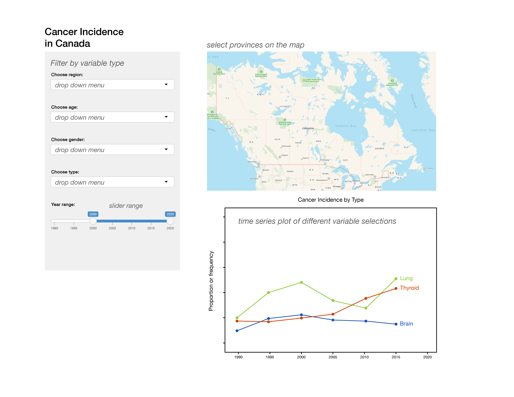

# Incidence of Cancer in Canada

By: Rachel Riggs, Constantin Shuster  
Date: January 12, 2018

### Project overview

Cancer is the leading cause of death in Canada, followed by heart disease. It represents close to [30%](https://www150.statcan.gc.ca/n1/pub/82-625-x/2014001/article/11896-eng.htm) of all annual deaths in Canada. However, cancer itself is a heterogenous illness with many different types that afflict the population in different ways. Therefore, in order to improve the health of the Canadian population it would be important to investigate which cancer types afflict the population the most, and whether there are any demographic trends that could be exploited for targeted public health intervention programs such as cancer screening. To aid researchers, physicians and healthcare policymakers in targeting their efforts to reduce the burden of cancer in Canada, we propose to build an interactive data visualization tool that explores cancer incidence in Canada. Using this tool, users will be able to select from various cancer types and view the trend of cancer incidence over time. Users will also be able to filter data by province, gender and age group to aid in the search of any particular demographic trends, such as the association of a particular cancer type with a particular age group, gender, or province.

### Canadian cancer incidence dataset

We will be using a [dataset](https://open.canada.ca/data/en/dataset/e667992c-5f2e-425a-8a44-a880930d82d8) that is maintained by Statistics Canada and publicly available. It contains ~4.9 million entries of epidemiologic statistics on the total number and rates of new primary cancers with 95% confidence interval bounds for incidence rates. Each row in the dataset specifies the year (REF_DATE), province (GEO), age group (21 groups), cancer type (58 types) and statistic type (total incidence, incidence rate, lower/upper bound 95% CI). The dataset spans year 1992 - 2015. Since the dataset is close to 1 gigabyte, our tool will visualize data about the top 10 most and least incident cancers to ensure the tool runs smoothly. This dataset was approved for this project by our TA, Alejandra Virgen-Urcelay.

### Usage scenario

Daniel works for the Canadian Cancer Society as an epidemiologist. He is interested in learning about whether the incidence of common cancer types has changed amongst the Canadian population over the last 20 years, and if so how. Specifically, he is interested in the demographic distribution of cancer incidence across different cancer types and whether any trends have changed. If there has been a change, Daniel may need to inform his team of researchers and physicians that there may be an opportunity to improve the health of Canadians by targeting these changing trends. For example, multiple mainstream news sources have been covering stories on colorectal cancer cases afflicting young patients in their 30s and 40s. Typically this cancer type affects older individuals, with primary cancer screening in Canada generally starting at age 50.

Daniel wants to [explore] a dataset where he can [select] amongst different cancer types the one that he is interested in. He would like to [investigate] how cancer incidence is distributed across the population based on age, gender, and region. Most importantly he would like to visualize how cancer incidence for a particular demographic group has changed over time in order to see if there has been any troubling increases. He would also like to [compare] trends of different cancers, common and rare, as he is very interested in lowering cancer-related mortality in Canada and he believes prevention is the key!

Daniel accesses the "Canadian Cancer Trends" app via the web where he sees a map of Canada with the provinces outlined. There is an overview of the variables to be modified on the left. He can filter demographic variables by using drop down menus to look at cancer incidence trends. To select a particular region he can click on the province on the map, otherwise Canada wide data is displayed. He chooses to look at colorectal cancer incidence in the age group 40-44 and 45-49 across all years and in Canada overall. A time-series graph shows up below the map and he notices that the incidence rate has increased after 2005 by ~25%. He forms a hypothesis that colorectal cancer may be on the rise in younger patients and brings this to the attention of his team to delve deeper into the issue and conduct a follow-up study since there may be confounding variables not assessed.

### Description and Sketch

The app contains a landing page that shows a map of Canada, which allows a user to select provinces to filter the dataset by. On the left panel various variables may be selected by the user from multiple dropdown menus (region, age, gender, and cancer type). Underneath these dropdown menus will be a slider range allowing the user to specify the range of years. This information will be visualized beneath the map in a time-series plot. Users can compare trends over time or among multiple kinds of cancers depending on their selections.

#### Example sketch

>>>>>>> upstream/master
